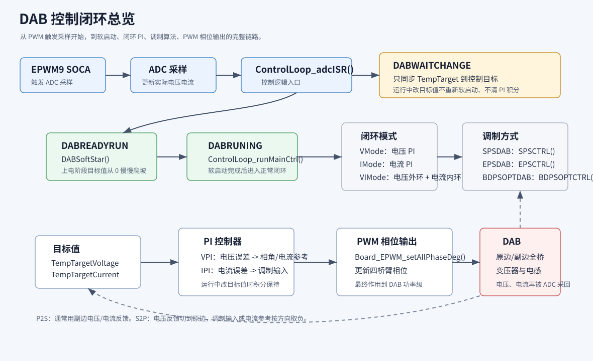
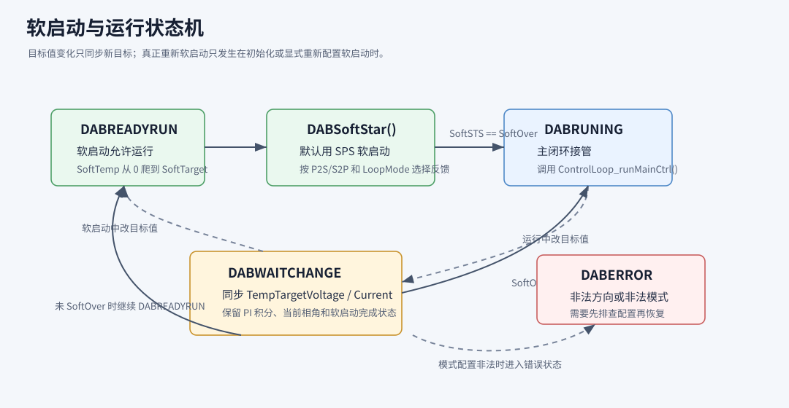
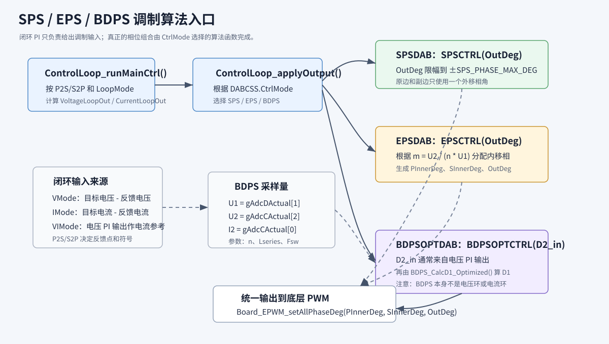

# F28388Test 控制层说明

这个目录放的是 DAB 双有源桥的“应用控制代码”。如果你只是想改目标电压、目标电流、功率方向、控制模式、软启动时间、PI 参数，大多数情况下只需要看这个目录，不需要改 `board/`、`device/`、`driverlib/` 里的驱动代码。

请优先看这几个控制层的文件：

| 文件 | 作用 |
| --- | --- |
| `ControlLoop.h` | 定义控制模式、功率方向、闭环模式、状态结构体 |
| `ControlLoop.c` | PI 参数、软启动、主控制逻辑、SPS/EPS/BDPS 调用入口 |
| `dab_bdps_opt.h` | BDPS 算法输入输出结构体、错误标志、参数声明 |
| `dab_bdps_opt.c` | BDPS 优化算法实现，计算 D1/D2 和轨迹编号 |

---

## 图文速览

看一下控制总图，就能知道控制代码每个部分在代码啥位置。



这张图可以这样读：

1. `EPWM9 SOCA` 定时触发 ADC 采样；
2. ADC 采样结果进入 `ControlLoop_adcISR()`；
3. 如果只是改目标电压或目标电流，ISR 只同步新目标，不重新软启动；
4. 上电阶段由 `DABSoftStar()` 慢慢爬坡；
5. 软启动结束后进入 `ControlLoop_runMainCtrl()`；
6. 主控制函数先看功率方向，再看闭环模式，最后选择 SPS/EPS/BDPS 调制算法输出 PWM 相角。

---

## 1. 先理解三个选择

控制代码里有三个最重要的“选择开关”。

### 1.1 调制方式 `CtrlMode`

这个决定最后用哪种调制函数写 PWM 相位。

| 枚举 | 含义 | 最后调用 |
| --- | --- | --- |
| `SPSDAB` | 单移相 SPS | `SPSCTRL()` |
| `EPSDAB` | 扩展移相 EPS | `EPSCTRL()` |
| `TPSDAB` | 三重移相 TPS | 当前未实现，会退回 `SPSCTRL(0.0f)` |
| `BDPSOPTDAB` | BDPS 优化调制 | `BDPSOPTCTRL()` |

如果 `CtrlMode` 配置成未知值，代码也会输出 `SPSCTRL(0.0f)`，避免 PWM 继续保持上一拍相角。

### 1.2 功率方向 `CtrlLoopTransmissionMode`

这个决定能量从哪边流向哪边。

| 枚举 | 含义 | 代码约定 |
| --- | --- | --- |
| `P2S` | Primary to Secondary，原边到副边 | 副边电压/电流作为主要反馈 |
| `S2P` | Secondary to Primary，副边到原边 | 原边电压作为电压反馈，电流参考或相角取反 |

### 1.3 闭环模式 `LoopMode`

这个决定用单电压环、单电流环，还是电压外环加电流内环。

| 枚举 | 含义 | 控制逻辑 |
| --- | --- | --- |
| `VMode` | 单电压环 | 电压 PI 输出直接作为调制输入 |
| `IMode` | 单电流环 | 电流 PI 输出直接作为调制输入 |
| `VIMode` | 电压外环 + 电流内环 | 电压 PI 输出作为电流参考，再进电流 PI |

`VIMode` 是串级环，电流环是快环，电压环是慢环。当前代码里：

```c
gControlCurrentLoopTsSec = 10.0e-6f;
gControlVoltageLoopDiv = 10U;
```

意思是电流环每个 ADC ISR 都运行，电压环每 10 个电流环周期运行一次。电压 PI 没到更新周期时，`VoltageLoopOut` 保持上一次的值，电流环继续用这个值作为电流参考。

---

## 2. ADC 量的含义

控制层使用的是 `gAdcCActual[]` 和 `gAdcDActual[]`，这些是已经按比例换算后的实际物理量。下标约定写在 `ControlLoop.c` 里：

```c
gAdcCActual[0] = Second Side Current        // 副边输出电流
gAdcCActual[1] = Second Side Tank Current   // 副边谐振/槽路电流
gAdcCActual[2] = Second Side Voltage        // 副边电压

gAdcDActual[0] = Primary Side Tank Current  // 原边谐振/槽路电流
gAdcDActual[1] = Primary Side Voltage       // 原边电压
gAdcDActual[2] = Primary Side Current       // 原边输入电流
```

注意：如果 ADC 标定比例不对，所有闭环都会不对。新上板时先确认这些变量在 CCS Expressions 里显示的值是否接近真实电压/电流。

---

## 3. 控制链路

每个 PWM 周期会触发 ADC，ADC 中断进入控制代码。

```text
EPWM9 SOCA 触发 ADC
    -> ADC 采样完成
    -> ControlLoop_adcISR()
    -> 更新 ADC 实际值
    -> 如果目标变化，则同步新目标值
    -> 上电阶段执行软启动
    -> 软启动完成后进入正常运行
    -> 主控制逻辑计算相角
```

状态切换关系如下图。最容易看错的一点是：`DABWAITCHANGE` 现在不是“重新软启动”的意思，而是“下一次 ISR 同步新目标值”。



核心状态如下：

| 状态 | 含义 |
| --- | --- |
| `DABREADYRUN` | 准备运行，正在软启动或准备软启动 |
| `DABRUNING` | 软启动完成，进入正常闭环运行 |
| `DABWAITCHANGE` | 有目标值变化，等待 ISR 同步新目标 |
| `DABERROR` | 模式非法或配置错误 |

目前代码里 `DABRUNING` 拼写少了一个 `N`，这是已有枚举名，保持一致即可，不要单独改名，否则所有引用都要一起改。

---

## 4. 软启动

软启动函数是：

```c
void DABSoftStar(CtrlLoop *C)
```

它只在 `DABREADYRUN` 状态下运行。软启动完成后：

```c
SoftSTS = SoftOver
```

然后 ISR 会把状态切到：

```c
DABRUNING
```

### 4.1 软启动目标怎么选

软启动配置函数是：

```c
ControlLoop_configSoftStart(&DABCtrl);
```

规则是：

| 闭环模式 | 软启动目标值 |
| --- | --- |
| `VMode` | `TargetVoltage` |
| `IMode` | `TargetCurrent` |
| `VIMode` | `TargetVoltage`，电压环慢慢给电流环参考 |

软启动内部用正幅值爬坡。`P2S/S2P` 的正负号在 `DABSoftStar()` 里根据方向处理。

### 4.2 软启动时间在哪里改

在 `ControlLoop_init()` 里：

```c
DABSoftStart.SoftTime = 2.0f;
```

单位是秒。比如想改成 5 秒软启动：

```c
DABSoftStart.SoftTime = 5.0f;
```

软启动每拍步长由代码自动计算：

```c
SoftStep = target * gControlCurrentLoopTsSec / SoftTime;
```

所以不要再手动写死 `100000` 这种频率数字。

如果软启动处在 `VIMode`，软启动目标仍然每个电流环周期爬坡，但电压外环不会每拍都算。它会按 `gControlVoltageLoopDiv` 分频更新，电流内环每拍运行，这样软启动和正常运行的串级环节奏一致。

### 4.3 运行中目标变化怎么更新

如果你在程序里改了目标值，把状态设成 `DABWAITCHANGE`：

```c
TempTargetVoltage = 48.0f;
TempTargetCurrent = 5.0f;
DABCSS.sts = DABWAITCHANGE;
```

下一次 ADC ISR 会自动：

1. 把 `TempTargetVoltage/TempTargetCurrent` 同步到控制目标；
2. 保留当前 PI 积分和当前 PWM 相角；
3. 如果软启动已经完成，直接回到 `DABRUNING` 正常运行；
4. 如果还处在上电软启动阶段，则继续留在 `DABREADYRUN`。

也就是说，运行中只改目标电压或目标电流时，不会重新从 0 软启动。闭环会在原来的工作点附近继续调节到新目标。

如果你改的是功率方向、闭环模式、调制模式这类“大模式”，建议先停机或专门设计一个模式切换状态，不要简单当成目标值变化处理。

---

## 5. 正常运行主控制逻辑

软启动完成后，正常运行函数是：

```c
ControlLoop_runMainCtrl(&DABCtrl);
```

它按三层逻辑执行：

```text
先看 P2S / S2P
再看 VMode / IMode / VIMode
最后看 SPSDAB / EPSDAB / BDPSOPTDAB
```

### 5.1 P2S 的控制逻辑

| 闭环模式 | 反馈量 | 输出 |
| --- | --- | --- |
| `VMode` | `gAdcCActual[2]` 副边电压 | 电压 PI 输出进调制 |
| `IMode` | `gAdcCActual[0]` 副边电流 | 电流 PI 输出进调制 |
| `VIMode` | 副边电压外环 + 副边电流内环 | 电压外环每 10 拍更新电流参考，电流内环每拍输出进调制 |

### 5.2 S2P 的控制逻辑

| 闭环模式 | 反馈量 | 输出 |
| --- | --- | --- |
| `VMode` | `gAdcDActual[1]` 原边电压 | 电压 PI 输出取负后进调制 |
| `IMode` | `gAdcCActual[0]` 副边电流 | 电流参考取负后进 PI |
| `VIMode` | 原边电压外环 + 副边电流内环 | 电压外环每 10 拍更新，输出取负后作为电流参考 |

---

## 6. 常见修改方法和修改的地方

### 6.1 改成 48V 输出，P2S，SPS，单电压环

```c
TempTargetVoltage = 48.0f;
TempTargetCurrent = 0.0f;

DABCSS.CtrlMode = SPSDAB;
DABCSS.CtrlLoopTransmissionMode = P2S;
DABCSS.LoopMode = VMode;
DABCSS.sts = DABWAITCHANGE;
```

### 6.2 改成 P2S，电压外环 + 电流内环

```c
TempTargetVoltage = 48.0f;
TempTargetCurrent = 5.0f;   // 可作为调试观察目标，VIMode 中实际电流参考来自电压环

DABCSS.CtrlMode = SPSDAB;
DABCSS.CtrlLoopTransmissionMode = P2S;
DABCSS.LoopMode = VIMode;
DABCSS.sts = DABWAITCHANGE;
```

### 6.3 改成 S2P 反向传输

```c
TempTargetVoltage = 48.0f;  // S2P + VMode/VIMode 时表示原边目标电压
TempTargetCurrent = 5.0f;

DABCSS.CtrlMode = SPSDAB;
DABCSS.CtrlLoopTransmissionMode = S2P;
DABCSS.LoopMode = VMode;
DABCSS.sts = DABWAITCHANGE;
```

### 6.4 改 PI 参数

电压环 PI 参数在 `ControlLoop.c` 顶部：

```c
volatile float32_t gControlVpiKp = 0.01f;
volatile float32_t gControlVpiKi = 0.001f;
volatile float32_t gControlVpiUmax = 10.0f;
volatile float32_t gControlVpiUmin = 0.0f;
```

电流环 PI 参数：

```c
volatile float32_t gControlIpiKp = 0.01f;
volatile float32_t gControlIpiKi = 0.001f;
volatile float32_t gControlIpiUmax = 1.0f;
volatile float32_t gControlIpiUmin = -1.0f;
```

运行时改完 PI 参数后，调用：

```c
ControlLoop_requestVoltagePIUpdate();
ControlLoop_requestCurrentPIUpdate();
```

如果两个环都改了，也可以：

```c
ControlLoop_requestAllPIUpdate();
```

不要把这些更新函数一直放在 ADC ISR 里每拍调用。推荐在上位机命令处理、调试命令处理、或慢任务里触发。

---

## 7. BDPS 使用说明

BDPS 算法入口：

```c
BDPS_CalcD1_Optimized(U1, U2, I2, D2_in, &gBdpsLast);
```

注意它本身不是电压环，也不是电流环。它只是根据当前采样和传入的 `D2_in` 计算内移相 `D1`。

三种调制算法在主控制里的关系如下：



当前代码允许 `BDPSOPTDAB` 从主控制逻辑接收不同闭环模式的输出，但实际最推荐先这样调：

```c
DABCSS.CtrlMode = BDPSOPTDAB;
DABCSS.CtrlLoopTransmissionMode = P2S;
DABCSS.LoopMode = VMode;
DABCSS.sts = DABWAITCHANGE;
```

BDPS 的电压 PI 输出会作为 `D2_in`，而 BDPS 内部把 `D2` 限制在 `0~0.5`。所以上板前建议把电压 PI 输出限幅也改到 `0~0.5` 量级：

```c
gControlVpiUmax = 0.5f;
gControlVpiUmin = 0.0f;
gControlVpiImax = 0.5f;
gControlVpiImin = 0.0f;
ControlLoop_requestVoltagePIUpdate();
```

BDPS 相关硬件参数在 `dab_bdps_opt.c`：

```c
volatile float32_t gBdpsN       = 4.0f;        // 变压器变比
volatile float32_t gBdpsLseries = 50.0e-6f;    // 等效串联电感
volatile float32_t gBdpsFsw     = 100000.0f;   // 开关频率
```

这些参数上板前必须按真实硬件确认。

---

## 8. CCS Expressions 建议观察变量

普通控制建议观察：

```c
TempTargetVoltage
TempTargetCurrent
DABCSS.sts
DABCSS.CtrlMode
DABCSS.CtrlLoopTransmissionMode
DABCSS.LoopMode
DABSoftStart.SoftSTS
DABSoftStart.SoftTemp
DABSoftStart.SoftTarget
DABSoftStart.SoftStep
DABCtrl.VoltageLoopOut
DABCtrl.CurrentLoopOut
gAdcCActual[0]
gAdcCActual[2]
gAdcDActual[1]
DABCSS.error
DABOverload.Overload_PrimarySide_TrankCurrent
DABOverload.Overload_SecondSide_TrankCurrent
DABOverload.Overload_PrimarySide_InputCurrent
DABOverload.Overload_SecondSide_InputCurrent
DABOverload.Overload_PrimarySide_Voltage
DABOverload.Overload_SecondSide_Voltage
```

`DABOverload` 是软件过流/过压保护阈值。ADC ISR 每拍换算完实际值后会先检查六个采样值，超限后写 `DABCSS.error`，状态切到 `DABERROR`，并通过 `Board_EPWM_forceLowAll()` 触发软件 TripZone 拉闸。

BDPS 建议额外观察：

```c
gBdpsLast.U1
gBdpsLast.U2
gBdpsLast.I2
gBdpsLast.K
gBdpsLast.PN
gBdpsLast.p0
gBdpsLast.D2_in
gBdpsLast.D2
gBdpsLast.D1
gBdpsLast.traj_id
gBdpsLast.err_flags
```

`gBdpsLast.err_flags == 0` 通常表示 BDPS 计算没有触发限幅或异常。如果长期不为 0，需要检查采样值、PI 输出限幅和 BDPS 参数。

---

## 9. 上板前检查清单

1. ADC 实际值是否正确：`gAdcCActual[]`、`gAdcDActual[]` 是否符合真实电压电流。
2. PWM 输出是否仍由 TripZone 安全控制，确认没有误释放。
3. `TempTargetVoltage` 先给小值，比如 5V 或 10V。
4. `DABSoftStart.SoftTime` 先给长一点，比如 2s 到 5s。
5. PI 输出限幅是否适合当前模式。
6. P2S/S2P 方向是否和硬件接线、采样符号一致。
7. 示波器确认四路 PWM 相位关系，再逐步加目标电压/电流。
8. `DABOverload` 六个保护阈值是否按真实硬件设置，确认故障时 ePWM 会被 TripZone 拉低。

---

## 10. 不建议改的地方

这些地方除非明确知道原因，否则不要改：

- `board/` 里的 ePWM、ADC、TripZone 底层初始化；
- `device/` 和 `driverlib/`；
- ADC 下标含义和标定比例；
- EPWM9 SOCA 触发源；
- `Board_EPWM_setAllPhaseDeg()` 的底层相位换算；
- BDPS 公式本身。

如果只是改控制目标、方向、模式、软启动时间、PI 参数，优先改 `ControlLoop.c` 和 `ControlLoop.h`。
