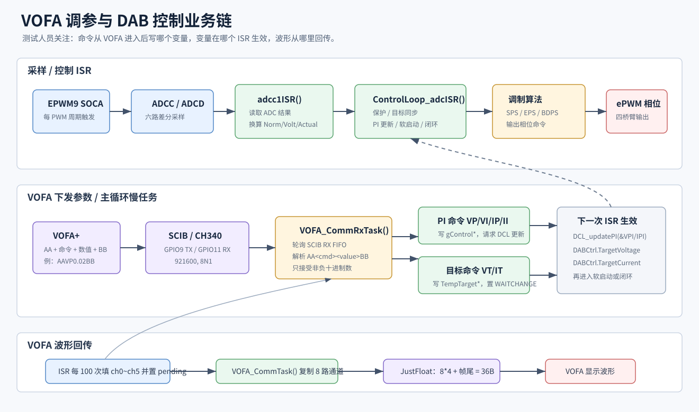

# F28388Test DAB 调参说明

这份 README 面向测试人员，重点说明 VOFA 怎么接、参数怎么下发、代码里最终赋值到哪里，以及哪些量需要在 CCS Expressions 或源码里改。

当前工程是基于 TI F28388D / C2000Ware 的 DAB 双有源桥控制工程。控制链路在 ADC 中断里运行，VOFA 串口收发放在主循环慢任务里运行，避免串口通信阻塞高频控制。

## 1. 调参业务链



完整链路分两条：

1. 采样和控制链路：`EPWM9 SOCA` 触发 ADCC/ADCD 采样，`adcc1ISR()` 读取结果并换算实际值，然后进入 `ControlLoop_adcISR()` 做保护、目标同步、PI 更新、软启动/闭环控制和 PWM 相位输出。
2. VOFA 调参链路：主循环调用 `ControlLoop_slowTask()`，内部先跑 `VOFA_CommRxTask()` 接收命令，再跑 `VOFA_CommTask()` 发送波形帧。VOFA 命令只改全局调参变量，真正生效点在下一次 ADC ISR。

## 2. VOFA 串口连接

| 项目 | 当前配置 |
| --- | --- |
| 串口硬件 | SCIB + CH340 |
| DSP TX | `GPIO9 / SCIB_TX -> CH340 RXD` |
| DSP RX | `GPIO11 / SCIB_RX <- CH340 TXD` |
| GND | DSP GND 和 CH340 GND 共地 |
| 波特率 | `921600`，定义在 `board/board_sci.h` 的 `BOARD_SCIB_DEFAULT_BAUD` |
| VOFA 协议 | JustFloat |
| 帧尾 | `00 00 80 7F` |

VOFA 初始化位置：

```c
Board_SCIB_init(BOARD_SCIB_DEFAULT_BAUD);
VOFA_CommInit();
```

## 3. VOFA 波形通道

当前 `VOFA_COMM_CHANNEL_COUNT = 8U`，所以 VOFA 里建议配置 8 个通道。实际代码目前只在 ISR 中填充 ch0~ch5，ch6/ch7 预留，默认保持 0。

| VOFA 通道 | 代码赋值位置 | 含义 |
| --- | --- | --- |
| ch0 | `VOFA_CommSetChannel(0U, gAdcCActual[0])` | 副边输出电流 |
| ch1 | `VOFA_CommSetChannel(1U, gAdcCActual[1])` | 副边槽路电流 |
| ch2 | `VOFA_CommSetChannel(2U, gAdcCActual[2])` | 副边电压 |
| ch3 | `VOFA_CommSetChannel(3U, gAdcDActual[0])` | 原边槽路电流 |
| ch4 | `VOFA_CommSetChannel(4U, gAdcDActual[1])` | 原边电压 |
| ch5 | `VOFA_CommSetChannel(5U, gAdcDActual[2])` | 原边输入电流 |
| ch6 | 暂未填充 | 预留 |
| ch7 | 暂未填充 | 预留 |

发送频率由 `VOFA_COMM_SEND_DECIMATION = 100U` 控制。每 100 次控制 ISR 置位一次发送请求，真正串口发送在主循环 `VOFA_CommTask()` 中完成。

单帧字节数：

```text
8 channels * 4 bytes + 4 bytes tail = 36 bytes
```

## 4. VOFA 下发命令

命令格式固定为：

```text
AA + 两位命令 + 十进制数值 + BB
```

示例：`AAVP0.02BB`。当前解析器只接受普通十进制格式，不要使用科学计数法；负数会被丢弃。

| 命令 | 示例 | 最终改到哪里 | 生效动作 |
| --- | --- | --- | --- |
| `VP` | `AAVP0.02BB` | `gControlVpiKp` | 调用 `ControlLoop_requestVoltagePIUpdate()` |
| `VI` | `AAVI0.001BB` | `gControlVpiKi` | 调用 `ControlLoop_requestVoltagePIUpdate()` |
| `IP` | `AAIP0.02BB` | `gControlIpiKp` | 调用 `ControlLoop_requestCurrentPIUpdate()` |
| `II` | `AAII0.001BB` | `gControlIpiKi` | 调用 `ControlLoop_requestCurrentPIUpdate()` |
| `VT` | `AAVT48BB` | `TempTargetVoltage` | 若非 `DABERROR`，置 `DABCSS.sts = DABWAITCHANGE` |
| `IT` | `AAIT5BB` | `TempTargetCurrent` | 若非 `DABERROR`，置 `DABCSS.sts = DABWAITCHANGE` |

PI 命令的生效路径：

```text
VOFA 命令
  -> 写 gControlVpiKp / gControlVpiKi / gControlIpiKp / gControlIpiKi
  -> 写 VPI_SPS / IPI_SPS 影子参数
  -> DCL_REQUEST_UPDATE()
  -> 下一次 ControlLoop_adcISR() 中 DCL_updatePI()
```

目标值命令的生效路径：

```text
VOFA 命令
  -> 写 TempTargetVoltage / TempTargetCurrent
  -> DABCSS.sts = DABWAITCHANGE
  -> 下一次 ControlLoop_adcISR()
  -> DABCtrl.TargetVoltage / DABCtrl.TargetCurrent
```

运行中只改 `VT` 或 `IT` 不会重新从 0 软启动。如果软启动已经结束，状态会回到 `DABRUNING`；如果软启动还没结束，会继续保持 `DABREADYRUN`。

## 5. 需要在 CCS Expressions 或源码里改的量

VOFA 当前只支持 `VP/VI/IP/II/VT/IT`。下面这些量目前没有 VOFA 命令，需要在 CCS Expressions 中改，或在源码初始化处改。

| 调参目标 | 变量 | 默认位置 / 默认值 | 注意事项 |
| --- | --- | --- | --- |
| 功率方向 | `DABCSS.CtrlLoopTransmissionMode` | `ControlLoop_init()`，默认 `P2S` | 可设 `P2S` 或 `S2P` |
| 闭环模式 | `DABCSS.LoopMode` | `ControlLoop_init()`，默认 `VMode` | 可设 `VMode`、`IMode`、`VIMode` |
| 调制方式 | `DABCSS.CtrlMode` | `ControlLoop_init()`，默认 `SPSDAB` | 可设 `SPSDAB`、`EPSDAB`、`TPSDAB`、`BDPSOPTDAB`；`TPSDAB` 当前回退到 0 移相 |
| 软启动时间 | `DABSoftStart.SoftTime` | `ControlLoop_init()`，默认 `2.0f` | 单位 s |
| 电压环输出限幅 | `gControlVpiUmax / gControlVpiUmin` | 默认 `10.0f / 0.0f` | 修改后要调用 `ControlLoop_requestVoltagePIUpdate()` |
| 电压环积分限幅 | `gControlVpiImax / gControlVpiImin` | 默认 `10.0f / 0.0f` | 修改后要调用 `ControlLoop_requestVoltagePIUpdate()` |
| 电流环输出限幅 | `gControlIpiUmax / gControlIpiUmin` | 默认 `1.0f / -1.0f` | 修改后要调用 `ControlLoop_requestCurrentPIUpdate()` |
| 电流环积分限幅 | `gControlIpiImax / gControlIpiImin` | 默认 `1.0f / -1.0f` | 修改后要调用 `ControlLoop_requestCurrentPIUpdate()` |
| 电压环分频 | `gControlVoltageLoopDiv` | 默认 `10U` | 电压环周期 = 电流环周期 * 分频；修改后要更新电压 PI |
| 保护阈值 | `DABOverload.*` | 默认都为 `1000.0f` | 电流按绝对值判断，电压按大于阈值判断 |
| ADC 标定 | `gAdcCActualOffset/Scale[]`、`gAdcDActualOffset/Scale[]` | `board/board_adc.c` | 实际值计算为 `(Norm - Offset) * Scale` |

BDPS 特别注意：`BDPSOPTCTRL()` 的输入是 `D2_in`，通常范围在 `0~0.5`。切到 `BDPSOPTDAB` 前，不要沿用电压环默认 `gControlVpiUmax = 10.0f`，否则会长期饱和，应把电压 PI 输出限幅整定到 0.5 量级。

## 6. ADC 实际值赋值位置

ADC 原始值在 `isr/isr.c` 的 `adcc1ISR()` 中读取：

```c
Board_ADC_UpdateCacheFromResult();
ControlLoop_adcISR();
```

换算链路在 `board/board_adc.c`：

```text
gAdcCRaw[] / gAdcDRaw[]
  -> gAdcCNorm[] / gAdcDNorm[]
  -> gAdcCVolt[] / gAdcDVolt[]
  -> gAdcCActual[] / gAdcDActual[]
```

实际值计算公式：

```c
Actual = (Norm - Offset) * Scale
```

ADC 通道约定：

```c
gAdcCActual[0] = Second Side Current
gAdcCActual[1] = Second Side Tank Current
gAdcCActual[2] = Second Side Voltage

gAdcDActual[0] = Primary Side Tank Current
gAdcDActual[1] = Primary Side Voltage
gAdcDActual[2] = Primary Side Current
```

上板先不要急着闭环。先在 VOFA 和 CCS Expressions 中确认这六个实际值的零点、比例、方向都对，再调整 PI 和目标值。

## 7. 推荐测试步骤

1. 不上高压，确认 CH340 串口接线、VOFA 能看到 8 通道 JustFloat 波形。
2. 观察 ch0~ch5，确认无输入时零点接近预期；如不对，先改 ADC offset/scale。
3. 检查 `DABOverload` 六个保护阈值是否符合本次硬件和供电条件。
4. 确认 `DABCSS.CtrlLoopTransmissionMode`、`DABCSS.LoopMode`、`DABCSS.CtrlMode` 与本次测试目标一致。
5. 先用小目标值：例如 `AAVT12BB` 或 `AAIT1BB`。
6. 小步调整 PI：先调 `VP/VI` 或 `IP/II`，观察 `DABCtrl.VoltageLoopOut`、`DABCtrl.CurrentLoopOut` 和 VOFA 波形。
7. 每次提高目标值前，确认 `DABCSS.error == 0` 且 `gBoardSystem.fault_latched == false`。
8. 出现异常先看 `DABCSS.sts`、`DABCSS.error`、`gBoardSystem.fault_latched`，不要直接继续加目标值。

## 8. 常用观察变量

```c
TempTargetVoltage
TempTargetCurrent
DABCSS.sts
DABCSS.error
DABCSS.CtrlMode
DABCSS.CtrlLoopTransmissionMode
DABCSS.LoopMode
DABSoftStart.SoftSTS
DABSoftStart.SoftTemp
DABSoftStart.SoftTarget
DABCtrl.TargetVoltage
DABCtrl.TargetCurrent
DABCtrl.VoltageLoopOut
DABCtrl.CurrentLoopOut
gAdcCActual[0]
gAdcCActual[1]
gAdcCActual[2]
gAdcDActual[0]
gAdcDActual[1]
gAdcDActual[2]
gBoardSystem.pwm_output_enabled
gBoardSystem.fault_latched
```

BDPS 调试变量：

```c
gBdpsLast.U1
gBdpsLast.U2
gBdpsLast.I2
gBdpsLast.D2_in
gBdpsLast.D2
gBdpsLast.D1
gBdpsLast.err_flags
```

## 9. 不建议测试时随便改

- `device/` 和 `driverlib/`
- ADC SOC 触发源和 SOC 顺序
- EPWM9 SOCA 触发链路
- TripZone 强制低电平逻辑
- `Board_EPWM_setAllPhaseDeg()` 的相位映射
- DCL 内部结构体字段
- BDPS 数学公式本身

测试调参优先使用 VOFA 命令和 CCS Expressions。只有确认需要改硬件映射、保护策略或新增 VOFA 命令时，再改源码。
